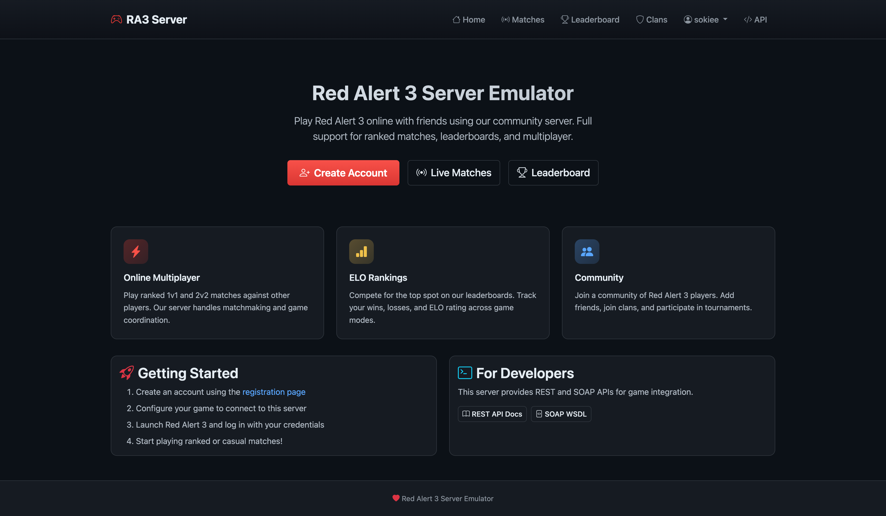
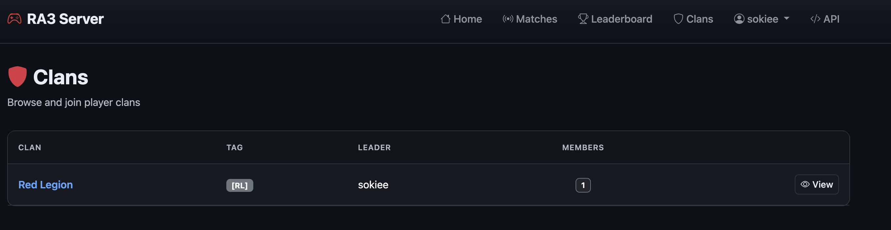

# Web Portal

The server includes a web portal for account management, leaderboards, and live match viewing. Access it at `http://localhost/` after starting the server.

## Pages

| Page | URL | Description |
|------|-----|-------------|
| Home | `/` | Landing page with server overview, features, and getting started guide |
| Register | `/register` | Create a new user account to play online |
| Leaderboard | `/leaderboard` | View ELO rankings for all game modes (1v1, 2v2, clan matches) with win/loss stats |
| Live Matches | `/matches` | See currently active games, players online, map info, and game settings |
| Clans | `/clans` | Browse, create, and manage clans |
| Clan Detail | `/clans/{id}` | View clan members, applicants, and manage membership |
| Login | `/login` | Log in to your account for clan management |
| API Docs | `/docs` | Interactive REST API documentation (Swagger UI) |

## Home Page

The home page provides an overview of the server features and quick links to get started.

Features displayed:
- **Online Multiplayer** - Play ranked 1v1 and 2v2 matches against other players with matchmaking and game coordination
- **ELO Rankings** - Compete for the top spot on the leaderboards with wins, losses, and ELO rating tracking
- **Community** - Join the community of Red Alert 3 players, add friends, join clans, and participate in tournaments

The home page also includes:
- **Getting Started** guide with steps to create an account, configure the game, and start playing
- **For Developers** section with links to REST API docs and SOAP WSDL for game integration

## Leaderboard

The leaderboard page displays player rankings sorted by ELO rating.

Features:
- **Game Mode Tabs** - Filter rankings by game mode: Ranked 1V1, Ranked 2V2, Clan 1V1, Clan 2V2
- **Player Stats** - View ELO rating, wins, losses, disconnects (DC), win rate, and total games
- **Rank Indicators** - Trophy icons indicate top-ranked players
- Rankings update automatically after each match

## Live Matches

The live matches page shows all currently active games on the server.

Features:
- **Active Games Counter** - Shows total number of games currently in progress
- **Players Online** - Displays how many players are connected to the server
- **Match Cards** - Each active game shows:
  - Game name and game mode (e.g., Clan 1v1)
  - Current status (Lobby, In Game)
  - Map being played
  - Player count and list of players
  - Mod version and game version
- **Auto-refresh** - Refresh the page to see updated match data

## Clans

The clans page allows players to browse, create, and join clans. Clan membership is reflected in-game during clan matches.

Features:
- **Clan List** - Browse all clans with their name, tag, leader, and member count
- **Create Clan** - Logged-in users can create a new clan (requires selecting a persona as leader)
- **View Details** - Click on any clan to see full details and membership

### Clan Detail

The clan detail page shows full information about a clan and its members.

Features:
- **Clan Header** - Displays clan name, tag, and shield icon
- **Members List** - Shows all members with their role (Leader/Member) and join date
- **Actions Panel** - Context-sensitive actions based on your relationship to the clan:
  - **Not logged in**: Prompted to log in to join
  - **Not in a clan**: Can request to join with persona selector
  - **Applicant**: Shows pending application status
  - **Member**: Can leave the clan
  - **Leader**: Can approve/reject applicants, kick members, and transfer leadership
- **In-Game Integration** - Clan membership is automatically shown in-game for clan matches
